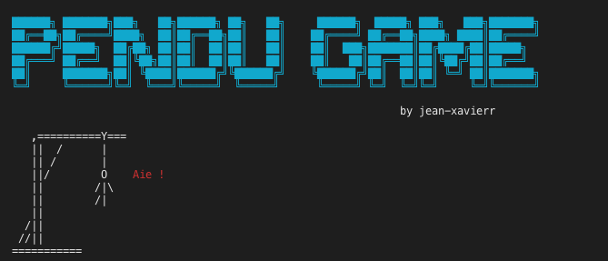

# Pendu_Game 

Pendu_Game is a program which reproduces the game Pendu in Python | Pendu_Game est un programme qui reproduit le jeu Pendu en Python :snake:

⚠️  _This program is developed for Unix OS (Mac OS, Linux, Debian ...), there is some error for Windows OS_

Le but du __jeu Pendu__ est de deviner un mot en proposant des lettres. Vous avez droit à un nombre limité d'erreur !
Si vous atteignez la limite des erreurs, vous avez __perdu__, si vous trouvez le mot avant d'atteindre la limite vous avez __gagné__ !

__Screenshot of the game__

